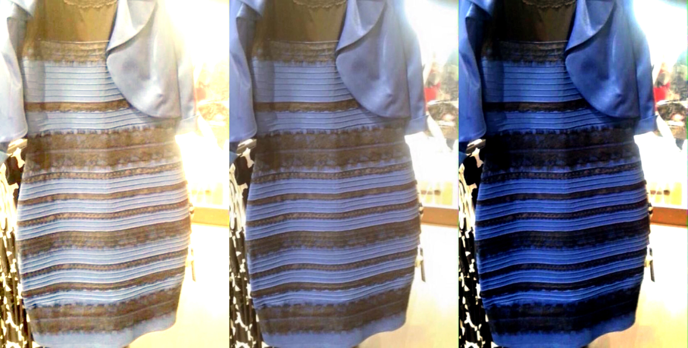
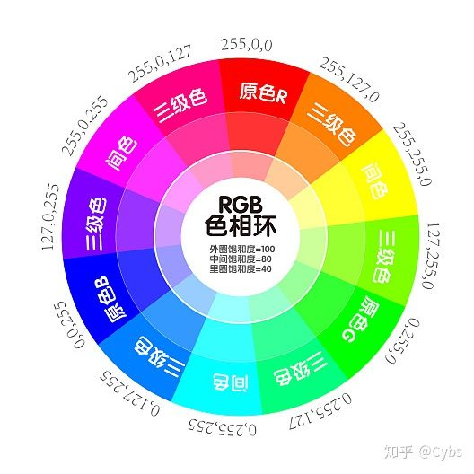

# Color Science 101

[TOC]

### 1. Color basic 

What is color? How we describe color?

- Color display spectrum

- [Trichromacy](https://en.wikipedia.org/wiki/Trichromacy)

  The Human's retina contains three types of color receptors (called cone cells in vertebrates) with different absorption spectra.
  
  We say S-cone, M-cone, L-cone, and they are activated by blue, green and red.
  
  
  
  They just like filter for lights.

- [Metamerism(同色异谱)](https://en.wikipedia.org/wiki/Metamerism_(color))

  Color is a biological phenominon. Now that human has only three color filters for nature lights, it means that some different combinations of lights could result in the same received waves in human's brains. 
  
  It is like this:
  
  

    
Metamerism spectrum example sample

    
  

- The color *Purple (magenta)* does not exist?

  We see the color wave length is linear, increasing from blue to red. But there are some colors exist between blue and red. Why?
  
  Theoretically, magenta between purple and red does not exist in nature color. It's a "imagine color" by our brain. It makes hue a ring. 
  
  

    
Hue ring

    
  

  
  See more in [color space](#42-color-space) section.

### 2. Color Vision 

#### Color relativeness

Color is relative. Our eyes is simple to be cheated.

  
Is A and B same? 

  

  
Now we hide the black and white blocks. 

  

### 3. Color Model 

#### 3.1 RGB

Red, Green, Blue.

- Additive color (mixing)

  

  Additive color models are applied in the design and testing of electronic displays that are used to render realistic images containing diverse sets of color using phosphors that emit light of a limited set of primary colors. 

#### 3.2 CYMK 

Cyan, Yellow, Magenta, **blacK**.

The more you mix, the darker it will be. 

Widely used in printing.

- Subtractive color (mixing)
  
  

  This idealized model is the essential principle of how dyes and inks are used in color printing and photography where the perception of color is elicited after white light passes through microscopic "stacks" of partially absorbing media allowing some wavelengths of light to reach the eye and not others.

- Why black? 

For cheapness. Mixing C, M, Y, we can get black. But in printing, we typically use black, always mixing CMY is too expensive and it introduces black in this system for a cheap printing for non colorful contents.

### 4. Color Space and Gamut 

#### 4.1 CIE 1931

[CIE 1931 color space](https://en.wikipedia.org/wiki/CIE_1931_color_space) are the first defined quantitative links between distributions of wavelengths in the electromagnetic visible spectrum, and physiologically perceived colors in human color vision. The mathematical relationships that define these color spaces are essential tools for color management, important when dealing with color inks, illuminated displays, and recording devices such as digital cameras. 

  
CIE 1931 RGB color matching functions 

  

  
It describes the how to mix up the visible colors in different wave length using RGB, to match what human can see.

  
The negative value means that mixing RGB could not present the target color at postive values. Then we mix color to target color to match back the test color and we subtract the value added to target color from the tested one.

  
The CIE 1931 color space chromaticity diagram 

  

#### 4.2 Color Space

###### Reading color space

- Tooltips and wave length

  
Tooltips of reading colorspace graph:

  

  

- Line of purples

  
<a href="https://en.wikipedia.org/wiki/Line_of_purples">Purple line</a>: 

  
  
As discussed above, purples like magenta does not exist on 

- White balance

  
Color temprature: 

  

  
Hues of the Planckian locus on a linear scale (values in kelvin) 

  

`White & gold, or blue & black ? `

  
White balance: 

  
  
Adjust white balance requires two dimensions: temprature (for blue to yellow) and tint (from green to red)

  

##### HSL/HSV

HSV cylinder

###### a. Hue

- The "kind" of color, regardless of attributes
- Colorimetric correlate: dominant wavelength
- Artist's correlate: the chosen pigment color

- Newton's color circle:

- Hue ring

###### b. Saturation

- The "colorfulness"
- Colorimetric correlate: purity
- Artist's correlate: fraction of paint from the colored tube

###### c. Lightness (or value)

- The overall amount of light
- Colorimetric correlate: luminance
- Artist's correlate: tints are lighter, shades are darker

Common color pickers are based on HSV/HSL. 

  
Color picker: 

  

It is actually a section view of the cylinder. 

#### 4.3 Gamut

[Gamut](https://en.wikipedia.org/wiki/Gamut) is the set of chromaticities generated by a set of color primaries, 

Different color spaces represent different ranges of color.

Typically, we see four standards in consuming monitors: sRGB, DCI-P3, AdobeRGB, and NTSC.

  
Common gamuts: 

  

- [sRGB](https://en.wikipedia.org/wiki/SRGB)
  sRBG, AKA standard RGB is the most widely adopted color space on computer today. **HP** and **Microsoft** created cooperatively in 1996 to use on monitors, printers, and the Web.
  
  - Common moditor RGB standard. Other color devices simulate that monitor by calibration.
  - Using 8-bit integer for R,G,B channels. 
  - Morden browser standard now support sRGB only. 
  - Gamut is limited. Tag "&lt;canvas&gt;" are discussed to support more wild gamut

- [NTSC](https://en.wikipedia.org/wiki/NTSC)
  Named after **National Television System Committee**. It's an old standard for TV. 
  
  - Old (1952), and for analog TV signals, not proper for digital monitor signals nowadays.
  - Wide range, but not that accurate. 
  - 72% NTSC ≈ 100% sRGB

- [DCI-P3](https://en.wikipedia.org/wiki/DCI-P3)
  Defined by the Digital Cinema Initiatives (DCI), expected to see adoption in television systems and in the home cinema domain.
  
  - Morden (2010), wild, cinema industry usage.
  - Uses a slightly warmer and greener whitepoint with a correlated color temperature of approximately 6300K
  - **Apple** products: iPhone, Macbook, iPad, etc.

- [AdobeRGB](https://en.wikipedia.org/wiki/Adobe_RGB_color_space)
  Developed by **Adobe** Systems, Inc.
  
  - Wide, **Adobe** products: PDF, PS, LR, PR, AE, etc.
  - Improving upon the gamut of the sRGB color space, primarily in ***cyan-green*** hues.
  - Printing standard. If you need a accurate printed color against what it shows on screen, AdobeRGB is necessary.
  
###### Gamut Coverage vs.  Gamut volume

- Gamut coverage is: the percentage of covered gamut area / the gamut area. 

- Gamut volume is: the percentage of the volume of the (device) supported colors / the volume of a gamut.

It means the "coverage" focuses on accuracy. The higher the coverage is, the more accurate of the device displaying the gamut.
And the "volume" focuses on amount. The higher the volume is, the more color that device could display.

###### [Color difference](https://en.wikipedia.org/wiki/Color_difference) 

- Euclidean distance
  Just describe the color's distance in distance.
  
  

    
Formula: 

    
    
Or, with weighting: 

    
  

  
- ΔE* (Delta-E)
  Human is not equally sensitive at different hue and lightness. Then CIE defines Delta-E for a more accurate color different. 
  
  - Based on CIELAB color space.
  - More accurate for most people, widely adopted. 
  - [MacAdam ellipse](https://en.wikipedia.org/wiki/MacAdam_ellipse) defines a tolerance of color in different colors.
      
      

        
MacAdam ellipse (x10): 

        
      

###### [Color depth](https://en.wikipedia.org/wiki/Color_depth) 
Color depth, AKA  bit depth, is the number of bits used to indicate the color of a single (sub)pixel. 

When we say RGB in web, we say a 8-bit color depth for R,G,B channels (also say 24-bit true color), each of which ranges from 0~255. And for a single pixel, we have 2^8 * 2^8 * 2^8 = 2^24 ≈ 16 million colors.

In a scenario color changes gradiently in short range, bit depth makes a difference obviously.

  

    
8-bit vs. 10-bit: 

    
  

- [FRC](https://en.wikipedia.org/wiki/Frame_rate_control)，Frame Rate Control
  FRC is a form of temporal dithering which cycles between different color shades with each new frame to simulate an intermediate shade. 
  Typically, physical 6-bit + FRC simulates a 8-bit, physical 8-bit + FRC simulates a 10-bit. 
  

#### SP-4.4 Suggestion for buying a monitor

1. Resolution: 2k for 21', 23'/24', 27' monitors. 4k for 27', 32' monitors. 
               1080P not recommended, 8k is of low price–performance ratio.
               Larger size? Why not a TV. 
               
2. Refresh rate： Theoeretically the higher, the better. High refresh rate is meaning for gaming (90Hz+), especially FPS (120Hz+)
               For movie and browser usage, 60Hz is enough anyway. 

3. Panel: IPS, VA, TN. Just pick IPS. 

4. HDR: HDR10, HDR400, HDR600, HDR1000. 
        10/400 is not recognizable. 600/1000 is very expensive. 
        No necessary unless you have blue-ray HDR movies. 
        If you need, better to have a HDR TV.
        
5. Gamut: (in product details/spec)
   - NTSC is really outdated. Do not pick one if it only says its NTSC coverage (typically 72%).
   - Confirm you are validting gamut coverage rather than volume. 
     If one says gamut volume only but no coverage (typically 120%+ even 140%), DO NOT BUY IT!
     An extremely high volume is actually a disadvange which will make color not accurate. And guess why them don't say their coverage?
   - 99% sRGB coverage is enough and for any common usage. It's a prerequisite for a higher persue.
   - Pick a P3 if you uses Apple products. As monitor for iMac, Macbook, Mac mini, iPad, etc. 
     90%+ P3 is good, pick a 95%+ P3 at an acceptable price. 
     Really comfortable (truct Apple), 
   - AdobeRGB coverage is always good, but expensive. Pay it for your interests on photographing and photo-printing. 

6. Color difference: Delta-E <= 2 is far good enough for non-expert user. Smaller is better, but not necessary.

7. Color depth: see the color amount spec. 1.07 billion is worth of picking (Typically 8bit + FRC, real 10bit is more expensive).
                Be careful for 16 million colors, check if it tells a real 8bit or 6bit + FRC. If no obvious information as a real 8bit, not recommend unless a extreme high performance price ratio.

* Test a screen with testing patterns: https://www.eizo.be/monitor-test/

### References
- [Wikipedia](https://en.wikipedia.org/)
- [GAMES101 - Morden Computer Graphics - Lingqi Yan](https://www.bilibili.com/video/BV1X7411F744?p=1)
- [The basics of color and color management](https://www.youtube.com/watch?v=fq-kNtwifFk&list=PLMsVycIbp_YsQVHP0CSjNDSBuaznyGC6l&index=3) @ [ColorPlaza TV](https://www.youtube.com/channel/UCIwTmFi6wFyHee9JNQ6YbTw)
- [Color WorkSpace: Using sRGB or AdobeRGB?](https://www.youtube.com/watch?v=UKfg8GtT75k) @ [ColorPlaza TV](https://www.youtube.com/channel/UCIwTmFi6wFyHee9JNQ6YbTw)
