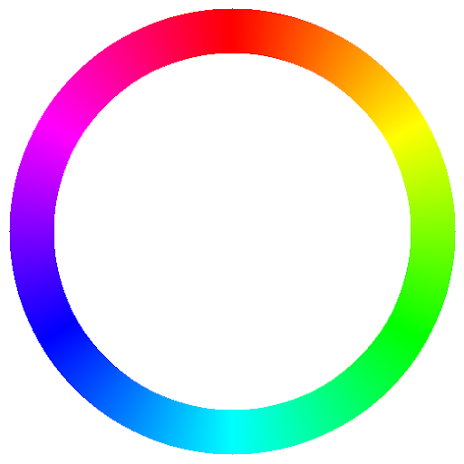

# Color Science 101

### 1. Color basic 

What is color? How we describe color?

- Color display spectrum

- [Trichromacy](https://en.wikipedia.org/wiki/Trichromacy)

  The Human's retina contains three types of color receptors (called cone cells in vertebrates) with different absorption spectra.
  
  We say S-cone, M-cone, L-cone, and they are activated by blue, green and red.
  
  
  
  They just like filter for lights.

- [Metamerism(同色异谱)](https://en.wikipedia.org/wiki/Metamerism_(color))

  Color is a biological phenominon. Now that human has only three color filters for nature lights, it means that some different combinations of lights could result in the same received waves in human's brains. 
  
  It is like this:
  
  

- The color *Magenta* does not exist?

  We see the color wave length is linear, increasing from blue to red. But there are some colors exist between blue and red. Why?
  
  Theoretically, magenta between purple and red does not exist in nature color. It's a "imagine color" by our brain. It makes hue a ring. 
  
  

### 2. Color Vision 

###

### 3. Color Model 

#### 3.1 RGB

#### 3.2 CYMK 

#### 3.3 HSL/HSV

##### a. Hue

- Newton's color circle:

- Hue ring

##### b. Saturation

### 4. Color Space and Gamut 

### References

- [The basics of color and color management](https://www.youtube.com/watch?v=fq-kNtwifFk&list=PLMsVycIbp_YsQVHP0CSjNDSBuaznyGC6l&index=3) @ [ColorPlaza TV](https://www.youtube.com/channel/UCIwTmFi6wFyHee9JNQ6YbTw)
- [Color WorkSpace: Using sRGB or AdobeRGB?](https://www.youtube.com/watch?v=UKfg8GtT75k) @ [ColorPlaza TV](https://www.youtube.com/channel/UCIwTmFi6wFyHee9JNQ6YbTw)
